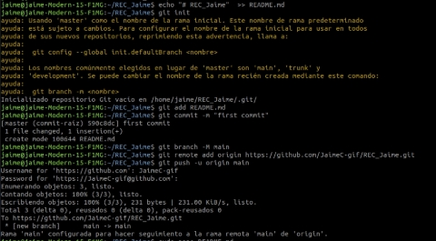
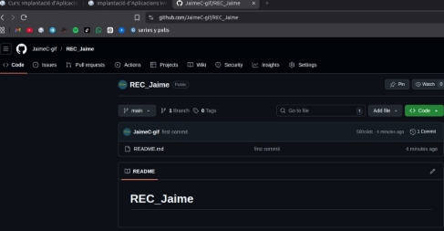
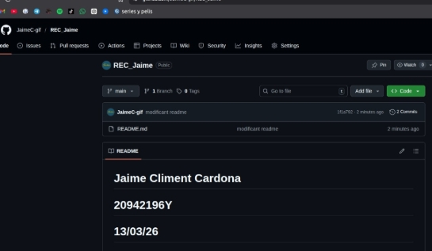
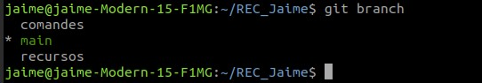
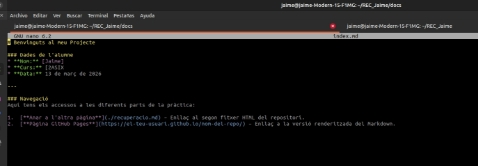
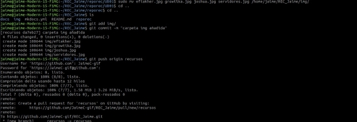
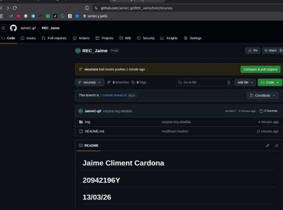
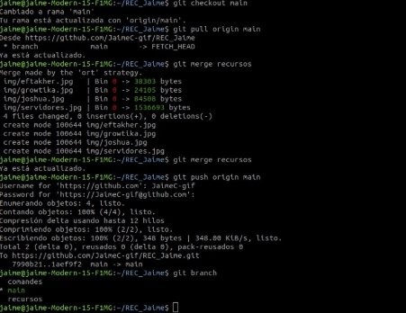
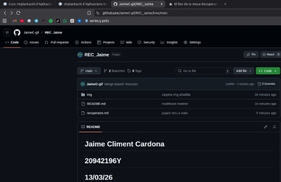

2 ASIX:    - **T**  **ema  ![ref1]PRACTICA   / //  **

|**Nombre: Nombre professor**|Jaime Climent Cardona Espe|**Grupo: 2 ASIX Grupo: 2 ASIX**|
| :- | :- | - |

|RECUPERAC|IÓ ESP|
| - | - |
|||
1. Caldrà que crees un repositori \*\*REC\_ElTeuNom\*\* per a fer l'examen.

*16/09/24 Página **1** de **4***

` `![ref1]
|2ASIX:    - **T**  **ema** |
| - |
|**PRACTICA  //**-**   Jaime Climent Cardona|

2. En la branca \*\*main\*\* crea un document README.md on inclouràs el teu NOM + DNI + Data d'examen.![ref2]

3. Crea una branca \*\*recursos\*\* i una branca \*\*comandes\*\*

4. La documentació ha d'estar creada amb \*\*MkDocs\*\*
4. En la branca \*\*main\*\* s'inclourà:
1. \*\*Pàgina d'inici\*\* amb el teu nom, curs, data i llista amb els enllaç a l'altra pàgina i a la pàgina generada en Pages.![ref3]

|2ASIX:    - **T**  **ema** |
| - |
|**PRACTICA  //**-**   Jaime Climent Cardona|

2. \*\*recuperacio.md\*\*: obtingut de la clonació del repositori [https://github.com/espemm/reporec.git](https://github.com/espemm/reporec.git) i corregit per obtindre el mateix resultat que es pot visualitzar en recuperacio.pdf (a la carpeta UD01).![ref2]
6. En la branca \*\*recursos\*\* crear una carpeta img i incloure les imatges de la carpeta UD01 del repositori [[https://github.com/espemm/reporec.git\](https://github.com/espemm/ reporec.git)](https://github.com/espemm/reporec.git%5D\(https://github.com/espemm/reporec.git\))

   Comandes utilitzades:

Vista final:![ref3]

|2ASIX:    - **T**  **ema** |
| - |
|**PRACTICA  //**-**   Jaime Climent Cardona|

7. Fusionar les branques main i recursos![ref2]

**URL![ref3]**

*Página  *****5***** de  *****5******

[ref1]: Aspose.Words.100e7a36-ed2a-4bdc-bde9-c24dcbb62455.001.png
[ref2]: Aspose.Words.100e7a36-ed2a-4bdc-bde9-c24dcbb62455.009.png
[ref3]: Aspose.Words.100e7a36-ed2a-4bdc-bde9-c24dcbb62455.012.png
